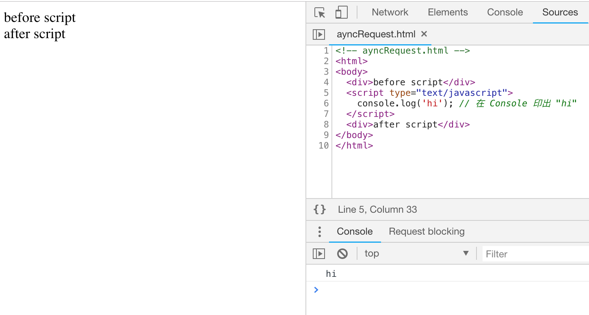
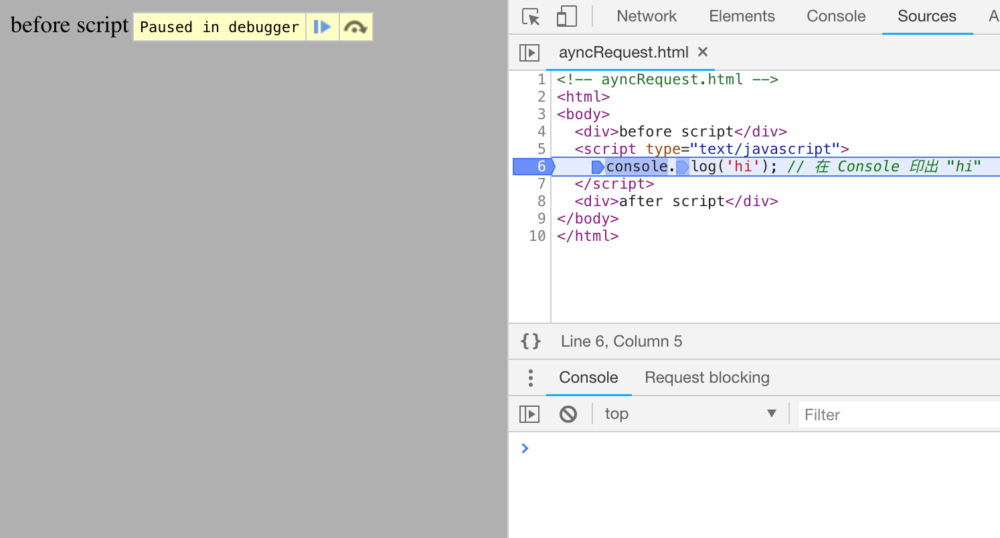
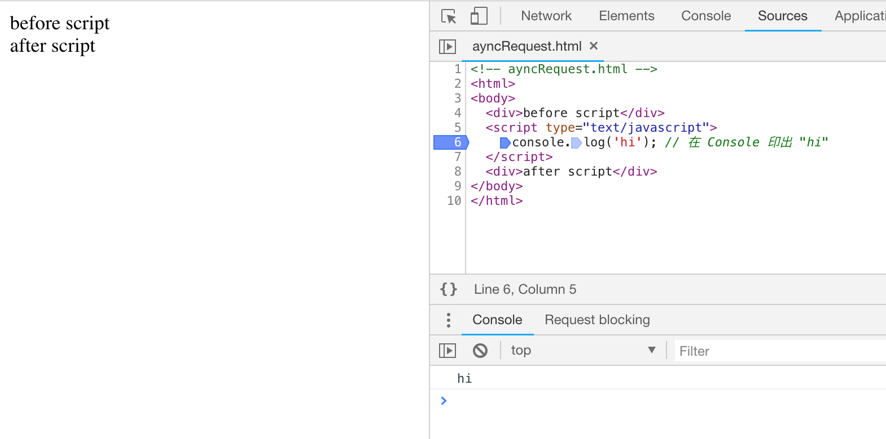
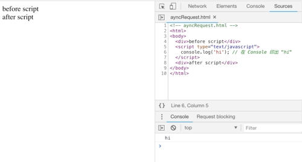
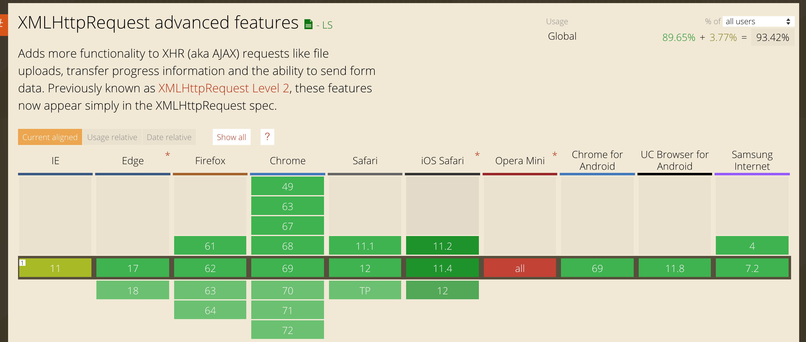
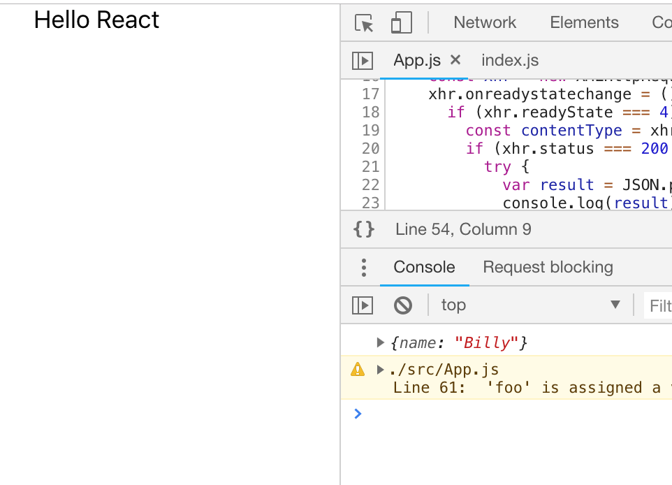
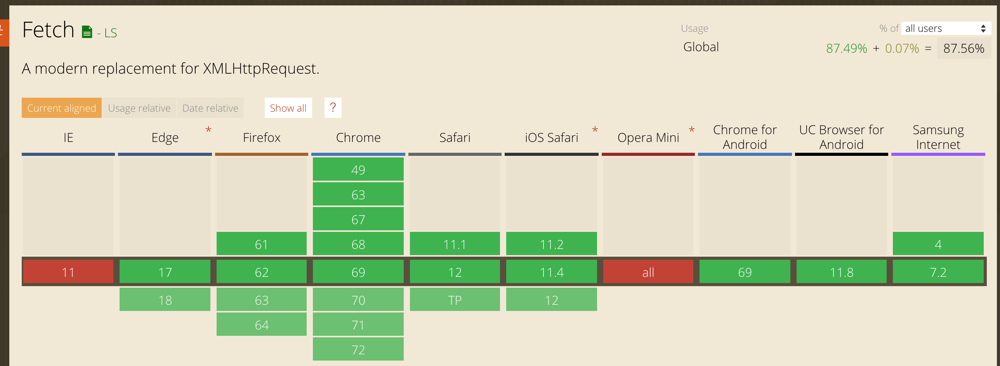
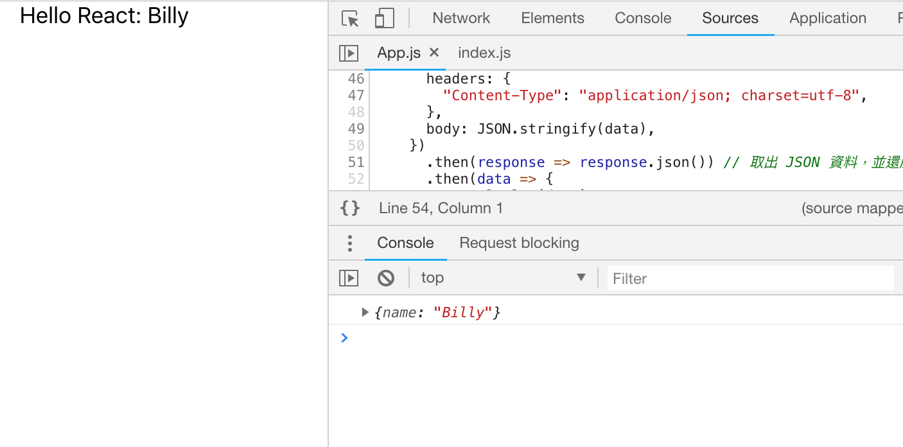

+++
title = "Day 11 - 一周目- 開始玩轉前端(二)"
date = "2018-10-11"
description = "發出一個非同步 request 串接後端"
featured = false
categories = [
]
tags = [
"2019 iT 邦幫忙鐵人賽",
"用js成為老闆心中的全端工程師"
]
images = [
]
series = [
"2019-iThome-Ironman"
]
+++

發出一個非同步 request 串接後端

<!--more-->

# 回憶

昨天介紹了 React 和完成用 `create-react-app` 建立了第一個 React app

# 目標
1. 發出一個非同步 request
1. 串接後端

在開始前，我們先來談談「非同步」

# 非同步函數是什麼？

## 來看看一個同步的例子：
1. 打開 `hello-react`，在 `public` 資料夾建立一個檔案 `ayncRequest.html`：內容如下
    ``` html
    <!-- ayncRequest.html -->
    <html>
    <body>
      <div>before script</div>
      <script type="text/javascript">
        console.log('hi'); // 在 Console 印出 "hi"
      </script>
      <div>after script</div>
    </body>
    </html>
    ```
1. 執行 `npm run start`
2. 開啟Chrome 再開 devTools，並選擇 Console 頁籤，打開 `http://localhost:3000/ayncRequest.html` 剛剛的頁面
    會看到以下的結果
    
    `console.log()` 會印出訊息在 Console 中

瀏覽器頁面渲染到一半，一看到 `<script/>` 就會立刻執行裡面的 javascript，也就是說 `console.log()` 立刻被執行

```
對於頁面渲染，console.log() 是同步地被執行。
```

> 試試看：你可以用 debug 模式証實它真的有停在那裡。若不會操作，可以看 [Day 10- 一周目- 開始玩轉前端(一)](https://ithelp.ithome.com.tw/articles/10200734)



## 一個非同步的例子：
修改 `ayncRequest.html` 加入 [`setTimeout()`](https://developer.mozilla.org/zh-CN/docs/Web/API/Window/setTimeout)
``` html
<!-- ayncRequest.html -->
<html>
<body>
  <div>before script</div>
  <script type="text/javascript">
    console.log('hi'); // 在 Console 印出 "hi"
    setTimeout(() => {
        console.log('time up'); // 兩秒後印出 "time up"
    }, 2000);
  </script>
  <div>after script</div>
</body>
</html>
```

再次刷新頁面

我們發現瀏覽器頁面渲染完後，等二秒後才會執行 `console.log('time up')`。

瀏覽器在執行渲染時， 下面的箭頭函
``` javascript
() => {
  console.log('time up'); // 兩秒後印出 "time up"
}
```
被 `setTimeout()` 存在某個地方後，頁面渲染結束後(看到 before script / after script)，等個兩秒，箭頭函數才被執行。此時的箭頭函數叫 **callback function**。

```
對於頁面渲染，console.log() 是非同步地被執行。因為箭頭函數的執行不是透過「頁面渲染」執行的。
```

下面的專案很有趣 [loupe by Philip Roberts](http://latentflip.com/loupe/)，可以看到瀏覽器非同步執行過程。

## 所以…結論是？
很有趣的是，我找不到有人給出非同步函數正式定義，因為非同步函數無法單獨定義，它是由行為所導致結果，如：「頁面渲染」因為 `setTimeout()`導致「頁面渲染」是非同步的執行(見：[Node.js Asynchronous Function *Definition* Ask Question](https://stackoverflow.com/questions/12835900/node-js-asynchronous-function-definition))。

本節最後，我說說我對非同步函數的看法是：

> 當一函數無法立刻得到執行函數的目地，就是非同步函數。一般利用 callback function 回傳結果。 

所以未來看到一個函數參數有定義 ***callback function*** 大部分都是非同步函數。

以後在二周目我們將會看到如何做出非同步執行的函數：
1. 利用 `setTimeout()`…系列
1. Promise
1. async/await

# 串接後端
上章提出了「非同步」的概念，現在來使用非同步函數，來發出非同步 request 的與伺服溝通。

## 準備環境
1. 打開並執行 `hello-react`前端開發網頁伺服器
1. 打開 [Day 9 - 一周目- 開始玩轉後端(二)](https://ithelp.ithome.com.tw/articles/10200622) 建的 `hello-express`，它有 `POST /api/echo` API
1. 因為前端占用 ***3000*** prot，後端要更改 port，修改 `package.json`
    ``` json
    "scripts": {
      "start": "PORT=3001 node ./bin/www"
    },
    ```
    `PORT`是環境變數，port 換成 ***3001***
1. 處理 [Cross-origin resource sharing (CORS)](https://en.wikipedia.org/wiki/Cross-origin_resource_sharing)問題。因為我們把前後端分開，在前端網頁會打非同步api(request)到不同主機的位置，**瀏覽器** 基於安全性會拒絕 request，且會出現下圖：
    
    1. 後端安裝套件 `npm install cors --save`
    2. 後端修改 `./app.js`
        ``` javascript
        // 加在前面
        var cors = require('cors');
        
        // 加在　var app = express(); 之後
        app.use(cors()); // 加入一個 middleware
        ```  
    此 middleware 加入後，express 會在 response header 回應加入一些訊息，讓瀏覽器辯識前端網站是否可以打到後端伺服器。為了方便，我們先不做任何設定，如此一來，後端會 **無條件地允許** 任何來源的前端網站發出 request(正常發佈時不應該讓任何人都可以打，未來會給出解決方法)。
1. 執行 `npm run start`

前端主機是 `http://localhost:3000`
後端主機是 `http://localhost:3001`

> 你可以用瀏覽器試試是否有正常運作或用 Postman

## 發出一個非同步 request
主要有兩個方法
1. `XMLHttpRequest` 物件
2. `fetch()` 函數

### XMLHttpRequest

[XMLHttpRequest](https://developer.mozilla.org/en-US/docs/Web/API/XMLHttpRequest) 是比較是很早期就出現的東西，用起來有點麻煩。使用前要建立 XMLHttpRequest 物件，再設定一些 callback，才送出 request。

1. 開啟前端 `./src/App.js`，加入 `componentDidMount()`成員函數
    ``` javascript
    class App extends Component {
      componentDidMount() {
        // 送到後端的資料
        const data = {
          name: 'Billy'
        };
    
        // 用 XMLHttpRequest 發起一個非同步的 request
        const xhr = new XMLHttpRequest();
        xhr.onreadystatechange = () => {
          if (xhr.readyState === 4) { // readyState == 4 為 request 完成
            const contentType = xhr.getResponseHeader('content-type');
            if (xhr.status === 200 && contentType && contentType.indexOf('application/json') > -1) {　// 依回應的資料格式處理，我們只處理 200 && application/json
              try {
                var result = JSON.parse(xhr.responseText);
                console.log(result)
              } catch(e) {
                console.error(e);
              }
            } else {
              console.error(new Error('無法得到資料'), xhr.responseText);
            }
          }
        }
        xhr.open("POST", "http://localhost:3001/api/echo"); // 開啟連線
        xhr.setRequestHeader("Content-Type", "application/json;charset=UTF-8"); // 設定 header
        xhr.send(JSON.stringify(data)); // 以文字字串送出JSON資料
      }
    
      render() {
        ...
      }
    }
    ```
1. 得到結果
    

這裡 `componentDidMount()` 是當 component 的渲染結果(html)插入 DOM tree 中就會呼叫。

使用 `XMLHttpRequest` 物件，以文字字串送出(`send()`) JSON 資料。因為有設定 `Content-Type: application/json;charset=UTF-8`，所以後端可以解讀。

每次 request 狀態改變，`onreadystatechange` 就會被呼叫，當 `readyState` 等於 `4` 就是 request 完成(不論成功還是失敗)。更多狀態見：[AJAX - onreadystatechange 事件](http://www.w3school.com.cn/ajax/ajax_xmlhttprequest_onreadystatechange.asp)

### fetch()

[fetch()](https://developer.mozilla.org/en-US/docs/Web/API/Fetch_API) 是比較新的函數，支援度也不錯，更重要的是，它可以當函數直接用，回傳 `Promise` 物件。 `Promise` 可以說是 javascript 最重要的物件，它包裝非同步操作，只要用 `then(resolveCallback).catch(rejectCallback)`，就可以接收非同步的結果。我們在二周目會再次見到它。

把上 使用 `XMLHttpRequest` 物件的　`componentDidMount()`，全部註解掉，貼上下面程式，也會得到一樣的結果

``` javascript
componentDidMount() {
    // 送到後端的資料
    const data = {
      name: 'Billy'
    };

    // 用 fetch() 發起一個非同步的 request
    fetch("http://localhost:3001/api/echo", {
      method: "POST",
      headers: {
        "Content-Type": "application/json; charset=utf-8",
      },
      body: JSON.stringify(data),
    })
      .then(response => response.json()) // 取出 JSON 資料，並還原成 Object。response.json()　一樣回傳 Promise 物件
      .then(data => {
        console.log(data);
      })
      .catch(e => {
        console.error(e);
      });
  }
```
`fetch()` 是不是用起來比較自然一點了，可讀性增加了。`fetch().then(resolveCallback1).then(resolveCallback2).catch(rejectCallback)` 是一種[鏈式語法](https://en.wikipedia.org/wiki/Method_chaining)，就是一直串下去要做的事。

流程如下：(你先不要看解釋，看程式就大概可以猜到過程了)
1. `fetch()` 一但成功取得資料，假設叫 `request`，就會把`request`往下一個 `then()`裡面的 callback 傳，就如同執行 `resolveCallback1(request)`。
1. `resolveCallback1(request)` 回傳一個由`response.json()` 產生的 Promise 物件，也會繼續如同之前一樣。 `response.json()` 成功時取得資料，假設叫 `data`，就會往下一個 `then()`裡面的 callback 傳，就如同執行 `resolveCallback2(data)`。
1. 最後 `catch(rejectCallback)`中的 `rejectCallback`什麼時後被叫呢？就是 `fetch()` 、 `resolveCallback1()` 或 `resolveCallback2` 有任何失敗或產生例外。

`then(resolveCallback).catch(rejectCallback)`用起來有點像 `try...catch`，但強多了，配合 `async/await` 這語法糖衣，又可以拆掉鍊式語法得到像同步的程式碼。我只寫出結果，看看它利害的地方，以後我們再談它們
``` javascript
componentDidMount() {
    // 送到後端的資料
    const data = {
      name: 'Billy'
    };

    const workerPromise = (async () => {
      // 用 fetch() 發起一個非同步的 request，等待回傳結果
      const response = await fetch("http://localhost:3001/api/echo", {
        method: "POST",
        headers: {
          "Content-Type": "application/json; charset=utf-8",
        },
        body: JSON.stringify(data),
      })

      // 等待 response.json() 回傳的 JSON 物件
      const resultData = await response.json();
      return resultData;
    })();

    workerPromise
      .then(data => {
        console.log(data);
      })
      .catch(e => {
        console.error(e);
      });
  }
```

## 把結果顯示在網頁上
接下來，後端的結果顯示在網頁上。

1. 加入 App　的成員變數 `state`，用來記錄 App component 的內部狀態
    ``` javascript
    state = {
        name: '',
    }
    ```
1. 在 `console.log(data)` 後面加入
    ``` javascript
    this.setState({
      name: data.name,
    });
    ```
    `setState()` 會更新的 state 內的值，並引起 App component 重新渲染 `render()`。
1. 使用內部狀態 `state`，修改 `render()`，
    ``` javascript
    render() {
        return (
          <div className="App" >
            Hello React: {this.state.name}
          </div >
        );
    }
    ```
完整的 App component 如下：
``` javascript
class App extends Component {
  state = {
    name: '',
  }

  componentDidMount() {
    // 送到後端的資料
    const data = {
      name: 'Billy'
    };

    // 用 fetch() 發起一個非同步的 request
    fetch("http://localhost:3001/api/echo", {
      method: "POST",
      headers: {
        "Content-Type": "application/json; charset=utf-8",
      },
      body: JSON.stringify(data),
    })
      .then(response => response.json()) // 取出 JSON 資料，並還原成 Object。response.json()　一樣回傳 Promise 物件
      .then(data => {
        console.log(data);

        // 更新的 state 內的值，並再一次引起渲染 render()
        this.setState({
          name: data.name,
        });
      })
      .catch(e => {
        console.error(e);
      });
  }

  render() {
    return (
      <div className="App" >
        Hello React: {this.state.name}
      </div >
    );
  }
}
```

得到結果



# 總結
今天引進了非同步的概念，並利用 `XMLHttpRequest` 物件 和 `fetch()` 函數引發一個 非同步的 request，得到結果後重新渲染畫面。
