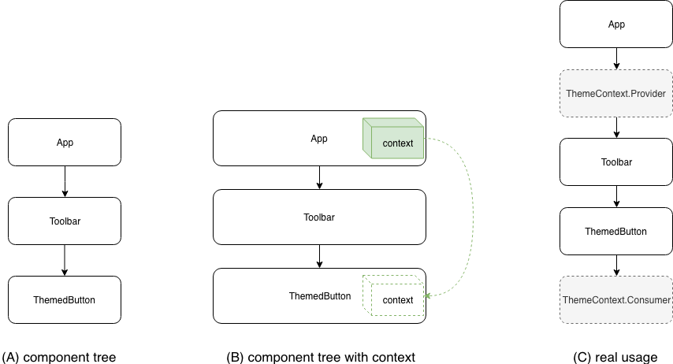
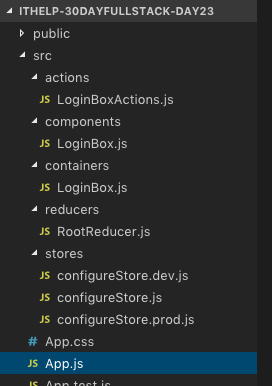
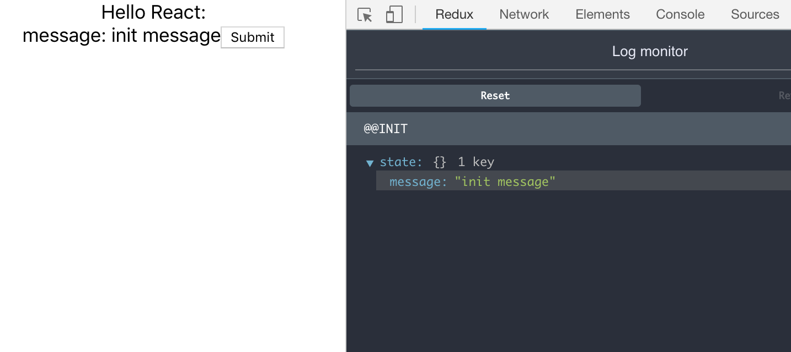
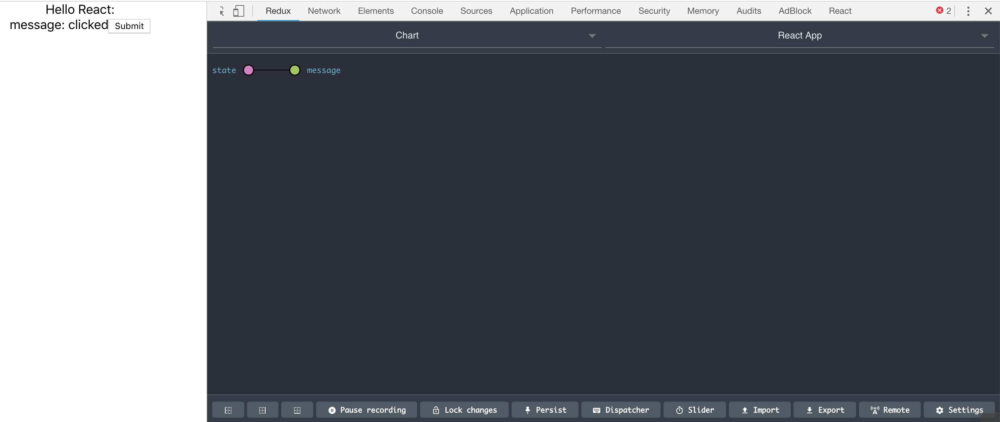

+++
title = "Day 23 - 二周目 - Redux 串接 React 與 Redux DevTools"
date = "2018-10-23"
description = "實作 Redux 與 React 的串接"
featured = false
categories = [
]
tags = [
"2019 iT 邦幫忙鐵人賽",
"用js成為老闆心中的全端工程師"
]
images = [
]
series = [
"2019-iThome-Ironman"
]
+++

實作 Redux 與 React 的串接

<!--more-->

# 回憶
昨天介紹了 Flux 架構和它的實作套件 Redux。最後我們寫了簡單的 Redux 程式，體驗 Redux 如何運作。以 Flux 架構圖來說， 昨天的內容是


今天我們要專注在與 React 的串接


# 目標
1. 實作 Redux 與 React 的串接
2. 安裝 Chrome extension [Redux DevTools](https://chrome.google.com/webstore/detail/redux-devtools/lmhkpmbekcpmknklioeibfkpmmfibljd) 確認 Redux 有運作

> [過程請見 github commit log](https://github.com/eugenechen0514/ithelp-30dayfullstack-Day23)

# Redux 與 React 的串接

我們實際引入 Redux 到之前的 `hello-react` 專案中

## 安裝 `redux`： 建立 Reducer, Store
1. 複制 [Day 11 - 一周目- 開始玩轉前端(二)](https://ithelp.ithome.com.tw/articles/10200933) 的專案 `hello-react`
2. 安裝 Redux： `npm install redux --save`
3. 建立 `RootReducer.js`，放在 `reducers/RootReducer.js`
    ``` javascript
    // reducers/RootReducer.js
    const initState = {};
    const reducer = (state = initState, action) => {
      const {type} = action;
      switch (type) {
          default:
              return state;
      }
    };
    
    export default reducer;
    ```
    
    這裡我們建立了一個 `RootReducer`，不打算合併其它的 reducer。若你需要更有結構的 state，你可以用 `combineReducers` 合併多個 reducer。以 `const rootReducer = combineReducers({ login: LoginReducer, account: AccountReducer,})` 來說， state 是巢狀物件，它有 `login`、`account` 分別可以索引到 `LoginReducer`、`AccountReducer` 裡面的 state。
3. 開一個 **stores** 資料夾，建三個檔案 `configureStore.js`、`configureStore.prod.js`、`configureStore.dev.js`
    ``` javascript
    // stores/configureStore.js
    if (process.env.NODE_ENV === 'production') {
        module.exports = require('./configureStore.prod');
    } else {
        module.exports = require('./configureStore.dev');
    }
    
    // stores/configureStore.prod.js 和 stores/configureStore.dev.js
    import { createStore } from 'redux';
    import RootReducer from '../reducers/RootReducer';
    
    export function configureStore(initialState) {
        const store = createStore(
            RootReducer,
            initialState,
        );
        return store;
    }
    ```
    我們未來只要 `import {configureStore} from 'stores/configureStore'` 就可以依照環境變數 `NODE_ENV`，選用 store。因為是同樣的程式碼，當 Redux DevTools 引入時就會不一樣。

## 安裝 `react-redux`：把 Store 送入 View 中

之前只安裝了 Redux 的 Reducer　和 Store，但最後我們要把 Store 送到 Controller-View 中，這樣 Controller-View 才可以用 store 拿出 state (`store.getState()`) 和 dispatch action (`store.dispatch(action)`)。

### React Context：component tree 中任何地方都可以拿到的值
為了完成這件事要用到 [React Context](https://reactjs.org/docs/context.html)，這是由 React 提供的，它的功用是在 component tree 中的上層把值送入後，底下的所有 subcomponent 任何一層都可以拿的到這值，而不用一個個傳遞下去。

舉官方例子：

(A)圖是本來的 component tree, 假設有個 `theme value` 要從 `App` 送 到 `ThemedButton` 中，用 Context API 後邏輯上就是 (B) 圖，實際使用Contenx API 就是 (C)圖。

``` javascript
// 建立一個 Context
const ThemeContext = React.createContext('light');

class App extends React.Component {
  render() {
    // 使用 ThemeContext.Provider 把值送入
    return (
      <ThemeContext.Provider value="dark">
        <Toolbar />
      </ThemeContext.Provider>
    );
  }
}

// 這是中間層的元件，不用把值送到 <ThemedButton/> 中
function Toolbar(props) {
  return (
    <div>
      <ThemedButton />
    </div>
  );
}

// 這是下層的元件，只要用 ThemeContext.Consumer，就可以取出值
function ThemedButton(props) {
  return (
    <ThemeContext.Consumer>
      {theme => <Button {...props} theme={theme} />}
    </ThemeContext.Consumer>
  );
}
```

回到 Redux，一般來說我們也要做類似的事情，但有大神們開發了 `react-redux` 套件幫我們把 Store 送入 View 中，我們甚至不會察覺到 context 的存在。

### `react-redux`： 串連 redux 和 react
`react-redux` 提供兩個好用的函數：

1. `Provider`：我們再也不用建立 Context，直接用庫提供的Provider `<Provider store={store}>` 送入 store
1. `connect(mapStateToProps, mapDispatchToProps)(component)`：連接 state 到 component props 和連接 「dispatch行為」 到 component props (指事件的 callback props, ex: `onClickButton`，要執行派發 action)。 更明確地說，這 API 結果就是回傳 `<component {...mapStateToProps()} {...mapDispatchToProps()} />`

> 其實， `connect` 是 high-order component (HOC)，它輸入 component 送出 component。見[重構 React component 邁向 Prue/Container component 和 HOC](https://medium.com/@yujiechen0514/%E9%87%8D%E6%A7%8B-react-component-%E9%82%81%E5%90%91-prue-container-component-%E5%92%8C-hoc-3df5adf35aaf)

開始套用吧~

#### 把 store 注入 component tree
1. 安裝 react-redux：`npm install react-redux --save`
1. 找到 Component 的入口 `./index.js`，建立 store，放入　`<Provider store={store}>`
    ``` javascript
    // index.js
    import { Provider } from 'react-redux';
    
    ReactDOM.render((
        <Provider store={store}>
            <App />
        </Provider>
    ), document.getElementById('root'));
    ```

#### 建立第一組 Container/ Pure component: LoginBox
Controller-View (component) 雖然沒有存 state，但它與 store 串連，所以它邏輯上來看就好像有自己 state，所以也可以稱為 **Container**。反之，完全沒有 state 的 component，被稱為 **Pure component**。

1. 建立 `components/LoginBox.js`
    ``` javascript
    import React, { Component } from 'react';
    class LoginBox extends Component {
      render() {
        return (
          <div>
            message: {this.props.message}
          </div >
        );
      }
    }
    export default LoginBox;
    ```
1. 建立  `containers/LoginBox.js`
    ``` javascript
    import { connect } from 'react-redux';
    import LobinBox from '../components/LoginBox'
    const mapStateToProps = (state) => {
        return {};
    };
    
    const mapDispatchToProps = (dispatch) => {
    };
    
    export default connect(
        mapStateToProps,
        mapDispatchToProps
    )(LobinBox);
    ```
1. 在 `App.js` 中使用 LoginBox Container 
    ``` javascript
    import LoginBox from './containers/LoginBox'
    class App extends Component {
      render() {
          return (
            <div className="App" >
              Hello React: {this.state.name}
              <LoginBox />
            </div >
          );
      }
    }
    ```

#### 加入 message state：配置空間和設定預設值
因為 LoginBox container 的 message 的值我們還沒有設定，所以你打開 `npm run start`，只會看到


1. 在 `RootReducer` 中設定 message state 變數和它初始的值
    ``` javascript
    // reducers/RootReducer.js
    const initState = {
      message: 'init message',
    };
    ...略
    ```
2. 在 LoginBox container 指定要使用這 state
    ``` javascript
    // containers/LoginBox.js
    const mapStateToProps = (state) => {
        return {
            message: state.message,
        };
    };
    ...略
    ```
    這裡的 state 就是 store 中全部的 state，就是 `RootReducer` 中定義的 state。
    `connect(...)(LoginBox)` 就好像把 `message` 送入 LoginBox pure component, ex: `<LoginBox message={state.message} />`

結果如下：


#### 加入行為
假如我們按一個 Button 就要改變 message 的值。

1. 在 LoginBox 加入一個 Button 和定義一個 `onClickSubmit` callback
    ``` javascript
    class LoginBox extends Component {
      render() {
        return (
          <div>
            message: {this.props.message}
            <button onClick={this.props.onClickSubmit}>Submit</button>
          </div >
        );
      }
    }
    ```
1. 開一個 **actions** 資料夾，建立 `LoginBoxActions.js`
    ``` javascript
    export const identityOnClickSubmit = 'identityOnClickSubmit';
    
    export function onClickSubmit(data) {
        return {
            type: identityOnClickSubmit,
            payload: data,
        };
    };
    ```
    > 我們很刻意的把資料放到 `playlod` 中(叫 `data` 也可以)，這不是一定要這麼做，只是為了保留最外層是 action 的專用屬性，防止 `data` 內也有 `type` 屬性干擾 action 最外層屬性。另外也有個好處，`data` 是陣列時，就有通用屬性名 `playlod` 可以取出陣列。
    
2. 在 LoginBox container 指定要使用 `onClickSubmit` 來派分(dispatch)一個 action
    ``` javascript
    ...略
    const mapDispatchToProps = (dispatch) => {
        return {
            onClickSubmit() {
                dispatch(actions.onClickSubmit({message: 'clicked'}));
            }
        }
    };
    ...略
    ```
1. RootReducer 要監控這個 action (即 `identityOnClickSubmit`)
    ``` javascript
    import * as actions from '../actions/LoginBoxActions';
    ...略
    const reducer = (state = initState, action) => {
      const {type, payload} = action;
      switch (type) {
          case actions.identityOnClickSubmit: {
            const {message} = payload;
            return Object.assign({}, {message});
          }
          default:
              return state;
      }
    };
    ```

結果如下：

按下Submit，message 改變了


最後看一下我們做了什麼？我們建了 Sore/Action/Container/Components 資料夾，來附合 Flux 架構，大部分 Flux 架構的前端專案都有類似的資料夾


# 在網頁中如何確認 Redux 有運作
Redux DevTools 用來看 Redux 運作，更明確的說，它在監控「dispatcher 和 action 的運作」及「action 如何影響 state」。馬上來試試看：

1. 下載 Chrome extension [Redux DevTools](https://chrome.google.com/webstore/detail/redux-devtools/lmhkpmbekcpmknklioeibfkpmmfibljd)
1. `createStore()` 中加入 store enhancer
    ``` javascript
    // stores/configureStore.dev.js
    import { compose, createStore } from 'redux';
    import RootReducer from '../reducers/RootReducer';
    
    const composeEnhancer = window.__REDUX_DEVTOOLS_EXTENSION_COMPOSE__ || compose
    
    export function configureStore(initialState) {
        const store = createStore(
            RootReducer,
            initialState,
            composeEnhancer()
        );
        return store;
    }
    ```
    * `createStore(reducer, initialState, enhancer)`第三個參數是 enhancer，拿來套用第三方的套件，修改 store creator，它是 hight-order function，它結合 store creator 成為另一新的 store creator。 store enhancer 簽章如下：
        ``` javascript
        function StoreEnhancer(next: StoreCreator): StoreCreator
        ```
        `createStore(reducer, initialState, enhancer)` 就像是 `enhancer(createStore)(reducer, initialState)`，`enhancer(createStore)` 變成新的 store creator。([見原始碼](https://github.com/reduxjs/redux/blob/master/src/createStore.js#L53))
        
    * `compose()` 是拿來以合併 store enhancer 用的。舉個例子：`compose(Enhancer1, Enhancer2)(createStore) => Enhancer1(Enhancer2(createStore))`
1. 開啟 Chrome DevTools(空白處右鍵 Inspect)，**Redux** 頁籤
    1. 一開啟網站的狀態
        
    1. 按下 Submit 後發出 action (action type 是 `identityOnClickSubmit`)
        

Redux DevTools 有三種模式
1. Log monitor：用來看 action log
    
1. Inspector：最完整的模式。能看 Action/State/Diff/Test，但這模式太大型的網站可能會很慢或當掉
    
1. Chart：state 的結構圖。 redux 的串接(`combineReducers()`) 會讓 state 是巢狀 object，這模式可以看 state 結構和各個 state 值。
    

每個模式都有它特別的地方，自己玩看看。

# 總結
今天我們實際串接 Redux 和 React，利用 **react-redux** 套件，就不需要自己寫 React Context。為了確保有運行，我們還裝了 Chrome extension Redux DevTools，可以查看 Redux 的運作。
