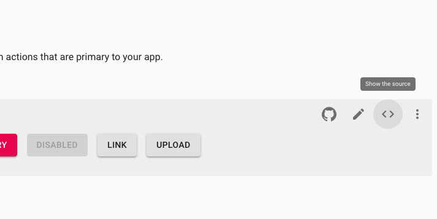
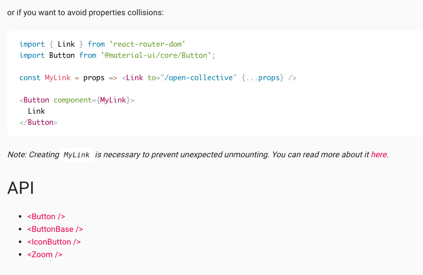
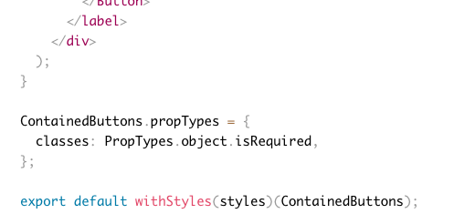
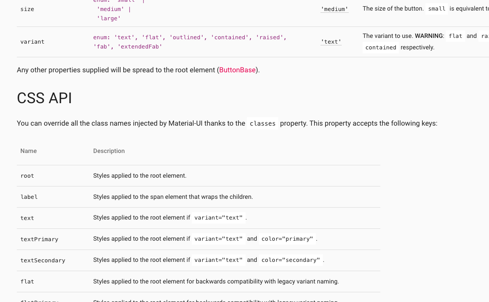

+++
title = "Day 25 - 二周目 - React component 套件 Material-UI： Google Material Design 的實作套件"
date = "2018-10-25"
description = "使用 Material-UI 的 component"
featured = false
categories = [
]
tags = [
"2019 iT 邦幫忙鐵人賽",
"用js成為老闆心中的全端工程師"
]
images = [
]
series = [
"用js成為老闆心中的全端工程師 - 2019 iT邦幫忙鐵人賽"
]
+++

使用 Material-UI 的 component

<!--more-->

# 回憶

前面三天都是在談 Redux 關於前端的資料流，今天要談一個「非必要」的 react component 套件：[Material-UI](https://material-ui.com)。它是[Material Design](https://material.io) 的 react 實作套件，它用來提供畫面的組件 (component)，像是 Button, Input, Dialog…等，充分地體現出 React component 讓我們以組件的概念組裝畫面。

我們曾在[Day 12 - 二周目 - 準備起程深入後端](https://ithelp.ithome.com.tw/articles/10201085) 中提到設計師做完設計稿後，會由一個前端工程師，做「切版」的工作，一般會寫出 HTML + CSS + Javascript。若前端框架採用 React，我們會把他們割一割封裝在各個 component，最後用 component 組裝畫面。

然而，不是每家公司都有「切版」的工程師。若只是單純的做後台網站，沒有對廣大的用戶，就不會講求畫面多絢麗、使用者體驗多利害，所以就有這種已經做好的畫面樣式的 component 可以直接使用，像是：[Material-UI(Google)](https://material-ui.com)，[Ant Design (螞蟻金服)](https://ant.design/)…等。

# 目標
> [過程請見 github commit log](https://github.com/eugenechen0514/ithelp-30dayfullstack-Day25)

1. 使用 Material-UI 的 component
1. 如何對為 component 加入css 樣式
1. 如何用 Material-UI `Grid` 排版

# 使用 Material-UI

Material-UI 功能特色：
1. 大量的基本 component
1. 樣式(css style)注入系統：`withStyles` 這個 HOC(high order component)，可以注入/覆寫樣式
1. 排版 component： `Grid`

## 安裝 Material-UI
Material-UI 歷經多次的 API 改版，現在的套件變的比較有組識了，基本元件全放到 **@material-ui/core** 中

1. 複制 [Day 23 - 二周目 - Redux 串接 React 與 Redux DevTools](https://ithelp.ithome.com.tw/articles/10204517) 的專案 `hello-react`
1. 安裝 `material-ui/core`： 安裝 `npm install @material-ui/core --save`
1. 安裝 `material-ui/icons`(可選)：  安裝 `npm install @material-ui/icons --save`, 這套件提供一些svg(Scalable Vector Graphics) icon

## 大量的基本 component

### 體驗一下 Material-UI
我們之前在 `hello-react` 中加入了一個 button 來發出一個 action，如圖 

現在我們來換成 Material-UI Button。修改前試想一下，我們要改的是畫面，所以應該改哪個資料夾的檔案呢？actions/stores/reducers/components/containers 哪一個？
若你之前有跟上文章的內容應該可以想到，答應就是
```
components
```
它是掌管畫面的資料夾，所以改 `components/LoginBox.js`

``` javascript
// components/LoginBox.js
import React, { Component } from 'react';
import Button from '@material-ui/core/Button';

class LoginBox extends Component {
  render() {
    return (
      <div>
        message: {this.props.message}
        <Button onClick={this.props.onClickSubmit}>Submit</Button>
      </div >
    );
  }
}
```
我們把 html tag `button`，換成是 Material-UI component `Button`。存檔後就完成了，看結果


如何？很容易吧! 有沒有體驗到下面的感覺呢？
1. Flux framework 資料夾結構的分類
1. React component 可以重構、組裝畫面
1. JSX 語法方便替換 html tag


#### 這麼多 component, 要怎麼用 Material-UI？
一打開 **Component API**  有沒有嚇一跳呢？要怎麼把它們組起來？


其實，可以不用一個個查，常用的 Demo 都有人整理好了，只要開 **Component Demos**

選你要的畫面 Demo，然後找到 **Show the source** 按鈕

就可以查到原始碼了，再貼到自己的專案中，就可以用了。

每個 Demo 頁面最下面還很貼心的附上相關的 API 連結，就可以進去看更多 component 用法。


## 樣式(css style)注入系統：「封裝 sytle」 或 「修改/替換樣式」

幾乎所有的 Demo code 最後面都會看到 `withStyles` 這個 HOC，如下圖：

這是那來封裝 sytle 或 overwrite style 用的，它的簽章如下：
```
styles => component => component
```
當 `withStyles(styles)` 時就是函數：
```
component => component
```

它把 component (class) 送入，產生新的 component (class)。不僅如此，它還把注入的 styles，放在 `classes` prop 中，你就可以在 component 使用注入的 style。

因為 `withStyles` 會把樣式注入 `classes` prop 中，所以 component 的 prop 定義 (`propTypes`) 要有 `classes: PropTypes.object.isRequired`。沒加入的話， Material-UI 也會警告你。

### 封裝 sytle

注意看到 `styles` 是巢狀物件，屬性名是 **css class name**，屬性值是 CSS 物件 ([見 CSS Object Model](https://developer.mozilla.org/zh-TW/docs/Web/API/CSS_Object_Model))。 透過 `withStyles(styles)(Component)` 後，它會把 **css class name** 也當做 `classes` prop 的屬性名但是 **值是字串**，也就是：
``` javascript
const styles = {
  myRoot: {
    backgroundColor: 'red',
  }
}
```
變成
``` javascript
this.props.classes.myRoot = '某個含有 myRoot 的字串的 css class name' 
```

舉個使用 `withStyles` 例子：
``` javascript
const styles = {
  myRoot: {
    backgroundColor: 'red',
  }
}

const Box = (props) => (
  <div className={props.classes.myRoot}>  <------ this.props.classes.myRoot 是字串，不是　styles.myRoot (CSS 物件)
    hi
  </div>
);

const withStyleBox = withStyles(styles)(Box);

// uasge: <withStyleBox />
```

#### 加載多個 style / 加載多個 class name

當你知道事實
```
this.props.classes.<style anme> = <string>
```
你會知道 component 如何加載多個 style：

``` javascript
const styles = {
  myRoot: {
    backgroundColor: 'red',
  },
  myLayout: {
    text: 'center',
  }
}

const Box = (props) => (
  <div className={props.classes.myRoot + ' ' + props.classes.myLayout}>  <------ 就和加載多個 class name 一樣
    hi
  </div>
);

const withStyleBox = withStyles(styles)(Box);

// uasge: <withStyleBox />
```

若你希望 `props.classes.myRoot + ' ' + props.classes.myLayout` 是動態的，可以使用 [classnames](https://www.npmjs.com/package/classnames) 套件，有條件的控制名稱是否出現，如：
``` javascript
classNames({ [props.classes.myRoot]: true, [props.classes.myLayout]: true }); // =>  props.classes.myRoot + ' ' + props.classes.myLayout
classNames({ [props.classes.myRoot]: true, [props.classes.myLayout]: false }); // =>  props.classes.myRoot
```

### 覆寫(overwrite) style: 修改/替換樣式
假如我們打開 [Button](https://material-ui.com/api/button/)，往下看到 CSS API


這就是你可以覆寫原始 component 樣式的 API。

直接舉個官網[例子](https://material-ui.com/customization/overrides/#overriding-with-classes)：

``` javascript
const StyledButton = withStyles({
  root: {
    background: 'linear-gradient(45deg, #FE6B8B 30%, #FF8E53 90%)',
    borderRadius: 3,
    border: 0,
    color: 'white',
    height: 48,
    padding: '0 30px',
    boxShadow: '0 3px 5px 2px rgba(255, 105, 135, .3)',
  },
  label: {
    textTransform: 'capitalize',
  },
})(Button);
```

用 `withStyles` 就可以替換 `root` 和 `label` 原來的樣式。

最後一個功能是：排版(layout)。

## 排版 component：回應/響應式網頁(responsive web)

Material-UI 和 [bootstrap](https://getbootstrap.com/) 一樣，它提供 Responsive API，只不過是 component 版本的。

[Grid](https://material-ui.com/api/grid/) 就是拿來做 responsive layout。它和 bootstrap 一樣採用 **12-column grid layout(12欄網格系統)**。

不管螢幕大小，一個 row 就是被切成 12 欄，你要設定排版怎麼分配欄位數。直接看例子：
``` javascript
<Grid container className={classes.root} spacing={16}>
  <Grid item xs={6} sm={4}>
    A
  </Grid>
  <Grid item xs={6} sm={4}>
    B
  </Grid>
  <Grid item xs={6} sm={4}>
    C
  </Grid>
</Grid>
```
你就知道怎麼用了，更多例子見 [Grid Demos](https://material-ui.com/layout/grid/)。

我們的心力還要花在設定 [Breakpoints](https://material-ui.com/layout/breakpoints/)，每個 breakpoint 有固定的螢幕大小
``` javascript
xs, extra-small: 0px or larger
sm, small: 600px or larger
md, medium: 960px or larger
lg, large: 1280px or larger
xl, extra-large: 1920px or larger
```

以上面例子來說：
1. `xs` 指的是當螢幕大於等於 0px 時要採用的「分配欄位數」，所以上面的結果是：
    ```
    A B
    C
    ```
    因為 `A` 和 `B` 的 `Grid` 各佔了6欄，它們剛好就是一個 row，所以 `C` 的 `Grid` 就會在下一 row。
1. `sm` 指的是當螢幕大於等於 600px 時，結果是：
    ```
    A B C
    ```
    因為 `A` 、 `B` 和 `C` 可以剛好放滿一個 row 共 12 欄。

### `Hidden` component

有時你會需要只有特定的螢幕大小，component 才會要出現/隱藏，這時候可以用 [`Hidden` component](https://material-ui.com/layout/hidden/)。

文件中給個例子：

```
innerWidth  |xs      sm       md       lg       xl
            |--------|--------|--------|--------|-------->
width       |   xs   |   sm   |   md   |   lg   |   xl

smUp        |   show | hide
mdDown      |                     hide | show
```

1. 若
    ``` javascript
    <Hidden smUp>
      ...may hidden dependent on screen size
    </Hidden>
    ```
    你的螢幕大小若大於等於 600px ，`Hidden` 內的東西就會隱藏。反之，小於 600px 時會顯示。

1. 若
    ``` javascript
    <Hidden mdDown>
      ...may hidden dependent on screen size
    </Hidden>
    ```
    你的螢幕大小若小於 1280px ，`Hidden` 內的東西就會隱藏。反之，大於等於 1280px 時會顯示。

# 總結

今天介紹了 Material-UI 的常用功能

1. 基本 component 的使用
1. 使用 `withStyles` 樣式注入
1. 使用 `Grid` 操作12欄網格系統

當沒有人寫做切版時，Material-UI 是一個可選方案。若你想做的畫面很絢麗、酷炫或太過客製化的 component，請花時間在 HTML + CS + Javascript中。若你願意包成 component 提供別人使用(如：[React Date Picker](https://www.npmjs.com/package/react-datepicker))，會有人感謝你的，


# 參考資料
* [Material-UI](https://material-ui.com/)
* [覆寫 Material-UI component CSS](https://medium.com/@yujiechen0514/%E8%A6%86%E5%AF%AB-material-ui-component-css-50337b537fe3)
