+++
title = "Day 9 - 一周目- 開始玩轉後端(二)"
date = "2018-10-09"
description = "做第一隻API、requests工具"
featured = false
categories = [
]
tags = [
"2019 iT 邦幫忙鐵人賽",
"用js成為老闆心中的全端工程師"
]
images = [
]
series = [
"2019-iThome-Ironman"
]
+++

做第一隻API、requests工具

<!--more-->

# 回顧
昨日建立我們的一個後端伺服器，今天來做第一隻API

# 目標
1. 自己的第一隻API
1. 使用 Chrome devTool 查看 requests 
1. POSTMAN 手動發出 requests

# 你的第一個api
我們曾在 [Day 8 - 一周目- 開始玩轉後端(一)](https://ithelp.ithome.com.tw/articles/10200476) 提及基於 http(s)協定下的Web API (Application Programming Interface)。Web API 常用來：
1. 系統間的介面：不同的系統間用 Web API 來串接，例如：現在很火的 chat bot ([Line Messaging API](https://developers.line.me/en/docs/messaging-api/overview/#spy-how-it-works))　的 webhook，由你的系統提供 Web API (即 webhook)，當有訊息時，Line 的系統會送 request 給你。
2. 前後端溝通介面：前後端架構中，後端會定義API，提供給前端網頁用非同步的request，查詢後端API。後端API會集中心力在處理商業邏輯和資料，而前端會集中心力在做畫面和使用者體驗。


## API 怎麼帶資料傳送

我們不會涉及太深入的 http(s)協定，只需要基本的了解就可以了。
從瀏覽器的角度看，有兩個訊息會傳送和接收：Request Message 和 Response Message。
他們都有 header 和 body 區塊。header 會記錄一些 [Metadata](https://en.wikipedia.org/wiki/Metadata)；而 body 是主要要傳送的資料。

1. *HTTP Request Message Format(From: [The TCP/IP Guide](http://www.tcpipguide.com/free/t_HTTPRequestMessageFormat.htm))*
    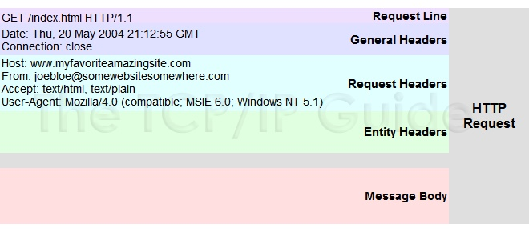
    1. 是發起查詢的人送出的訊息，像是瀏覽器
    2. 送出headers，內容包含： http(s)/API 的查詢方法(如GET/POST )、客戶端能了解的資料格式(如圖中 `Accept: text/html, text/plain`)
    3. 送出body：送給接收端(後端)的資料，通常會加入 `content-type` header，讓接收端了解資料的格式
1. *HTTP Response Message Format(From: [The TCP/IP Guide](http://www.tcpipguide.com/free/t_HTTPResponseMessageFormat.htm))*
    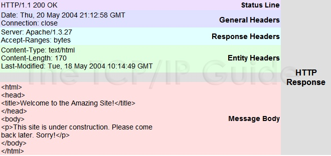
    1. 是接收端收到 request message 後做出的回應，像是後端伺服器對API的查詢結果做出回應
    2. 訊息要包含[狀態代碼(status code)](https://developer.mozilla.org/zh-TW/docs/Web/HTTP/Status)，表示API 的查詢狀態代碼，如：大名鼎鼎的 **404**，找不到網頁/資源。這狀態代碼後端想傳什麼都可以，但有些狀態代碼有被加入[規範](https://tools.ietf.org/html/rfc2616#section-10)中，儘量不要重覆到，因為瀏覽器可能會依照代碼給錯誤訊息。通常 **200** 是指 request 成功得到正常的 response
    3. 跟 request 一樣，通常會加入 `content-type` header，使送訊息者(前端)了解 body 的格式

以下是從 Chrome devtools 截下來的實例：
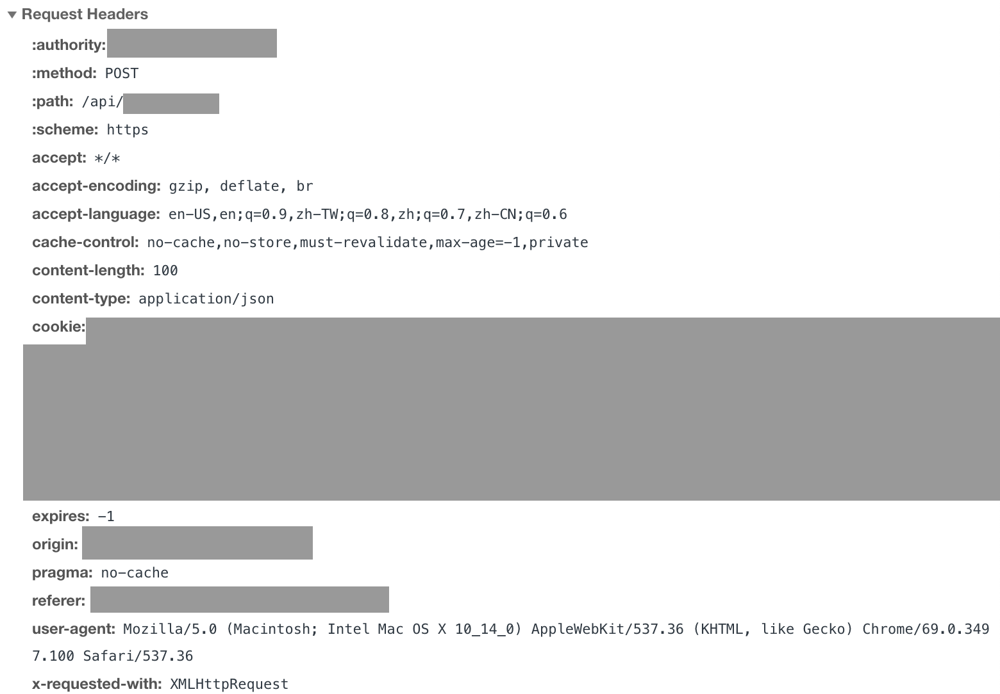
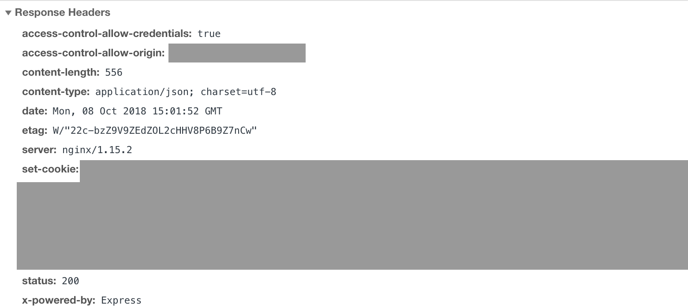
實際上，不單只有資料，雙方送出的 header 會更多，互動的行為才會更強健(robust)。

## body 資料像什麼？
上面我們的知道了 `content-type` header，會用來告訢接收端資料的格式，方便接收端解讀資料。它可能的值見 [Multipurpose Internet Mail Extensions (MIME) type](https://developer.mozilla.org/en-US/docs/Web/HTTP/Basics_of_HTTP/MIME_types)。

我們的前後端架構中，希望後端只送「純」資料給前端，而前端自己才產生HTML，所以我們採用 [JSON 格式](https://zh.wikipedia.org/wiki/JSON)，它是以易於閱讀的 ***文字*** 為基礎，來傳送資料。JSON 的官方定義 MIME 為 `application/json`。如下圖：
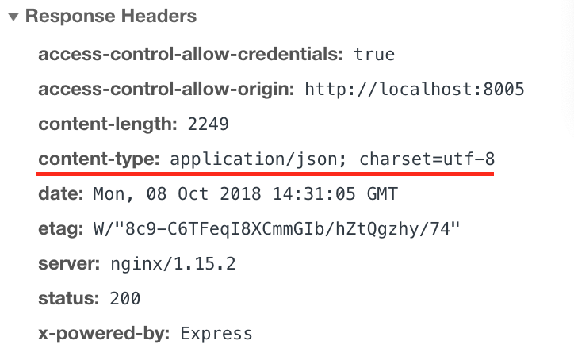
除了MIME 外，還用 `charset` 指明文件的編碼。

很幸運地，javascript 由原始型別(Primitives)，像是 `string`, `number`, `null`, `boolean`, `Array`, `Object`， 組成的 object，剛好符合JSON格式。如：

``` javascript
const person = {
  id: '001',
  name: 'Billy',
  married: false,
  friendIds: ['002', '003'],
  accessories: [{
    name: '眼鏡',
    brand: null,
    price: undefined, // 這裡偷放了 `price: undefined`，序列化會自動過濾。
  }],
};
```

因為object中都是用原始型別組成的 ，所以它們可以正常轉成文串，也就是`JSON 可序列化(JSON serializable)`
``` javascript
console.log(JSON.stringify(person)); // {"id":"001","name":"Billy","married":false,"friendIds":["002","003"],"accessories":[{"name":"眼鏡","brand":null}]}
```


## 來吧！建立第一個API
1. 打開[昨天](https://ithelp.ithome.com.tw/articles/10200476)建的hello-express
2. 打 `./router/index.js`檔案
    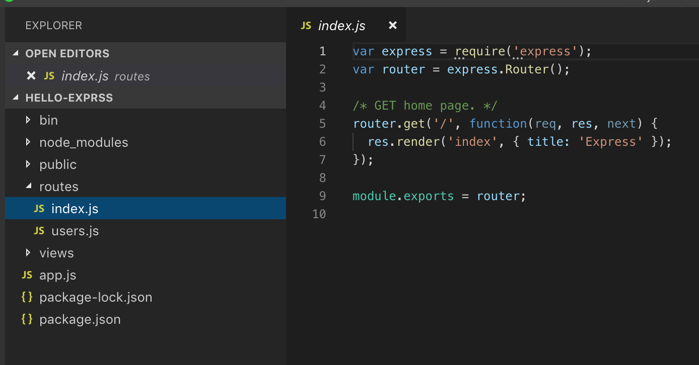
3. 建立第一隻 `GET` API
    ``` javascript
    var express = require('express');
    var router = express.Router();
    
    /* GET home page. */
    router.get('/', function(req, res, next) {
      res.render('index', { title: 'Express' });
    });
    
    router.get('/api/sayHi', function(req, res, next) {
      res.send('hi');
    });
    
    module.exports = router;
    ```
    `router.get` 表示接受來自 `GET` 的 request，其它的以些類推 (ex: `router.post`, `router.delete`...)
4. 執行伺服器 `npm run start` 或用 debug 模式執行 `./bin/www` 都可以
5. 開啟瀏覽器，進入 `http://localhost:3000/api/sayHi`，就會出現下圖


瀏覽器其實是發出一個 GET request，接下來我們驗証看看。

## 從Chrome 瀏覽器看 request
1. 開啟瀏覽器，進入 `http://localhost:3000/api/sayHi`，就會出現下圖
1. 開 devTools 後，選 `Network` 頁籤
  在空白處右建
  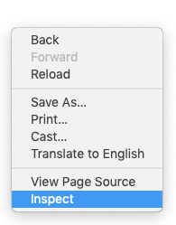
  或按鍵盤`F12`，就可以開啟
  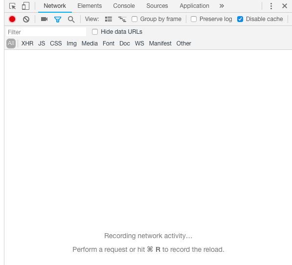
1. 是空的! 別怕只要刷新再開一次就好，因為開啟 devTools 後才會記錄
    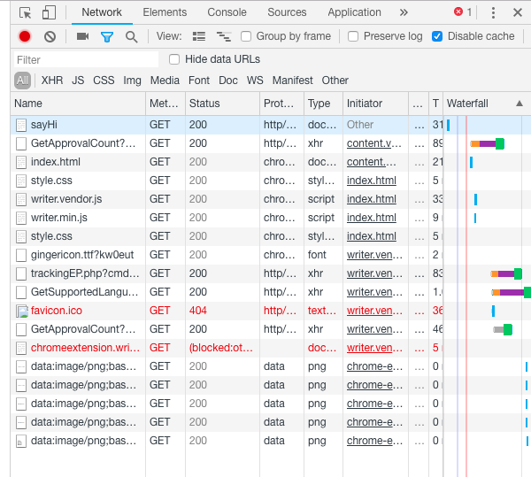
    出現一堆 request，哪個才是我們的呢？
    > 你的可能會會跟我不一樣，有些 Chrome 的插件(extension)在開新頁面時也會發出 request
1. 過濾 request：在上面有個小框框，輸入 `api` 就可以過濾

1. 點擊 `sayHi` 的 request，可以看到 request 的訊息，像是requst/response/header/body....等。
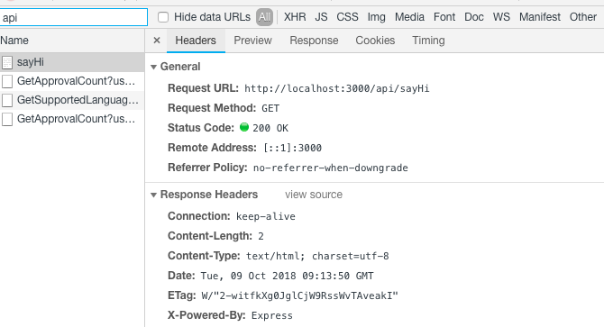

所以我們發現一件事：用瀏覽器開一個網址其實就是打一個 **GET request** 到伺服器

如果我們想要發出 POST request 怎麼辨？

# 如何手動發出 requests?
發出 requests 的工具很多，像是 [Advanced REST client](https://chrome.google.com/webstore/detail/advanced-rest-client/hgmloofddffdnphfgcellkdfbfbjeloo?hl=zh-TW), [POSTMAN](https://www.getpostman.com/)…等，上 google 很容易找到一堆。 

我們要使用的是 POSTMAN，他早期也是 google extension 上的一個 app，之後變成一個獨立的程式了，也出現訂閱服務。
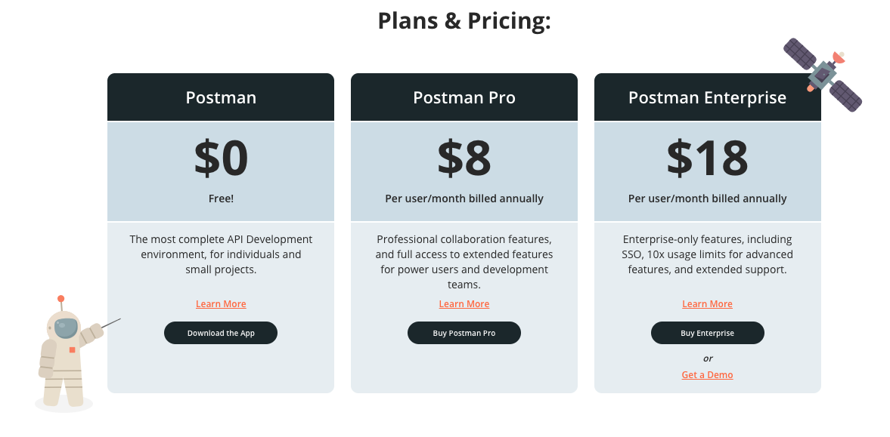

但我覺得免費版就夠用了，免費可以
1. 模擬一個 request，設定 header, body…等
1. 儲存每個 request，也可以命名、加 **Markdown** 描述，甚至是存下回應後的結果
1. 有送出 request 的歷史清單
1. request 打包成 collection(可想成是一個資料夾放一群 request)
  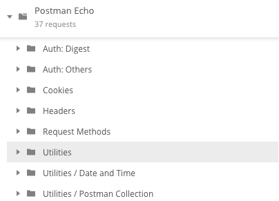
1. 匯入/出collection
1. 環境變數
    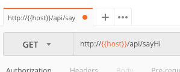
    `{{host}}` 是環境變數，可以在 POSTMAN 中任意切換套用環境組態
1. 同步request資料在連結的 Google 帳號中

## 使用 POSTMAN 發送 GET request
1. [下載 POSTMAN](https://www.getpostman.com/apps)
1. 建立一個 request，按 + 號
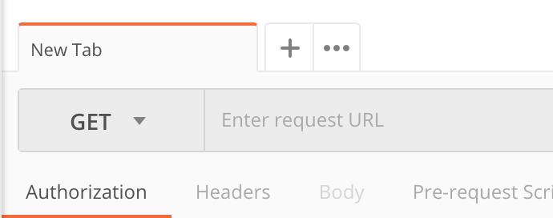
1. 輸入 `http://localhost:3000/api/sayHi`，按送出

1. 就得到和瀏覽器一樣的結果
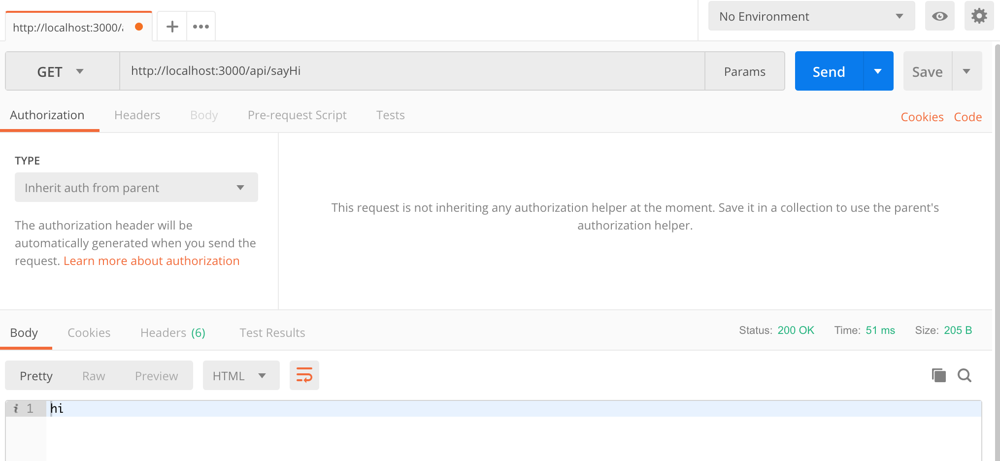
跟 Chrome 一樣可以看到 request/response 的資料

最後回答問題：怎麼發出 POST request呢？ 就…換 request method
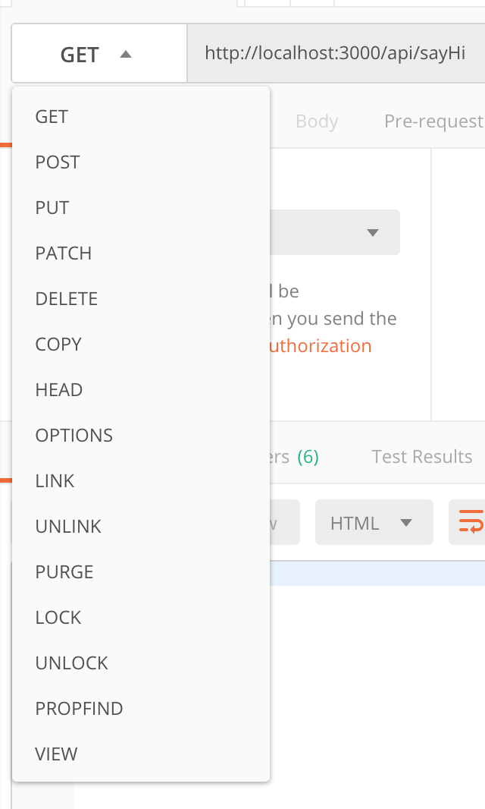

# JSON 格式交互資料
之前說，我們要傳遞資料的格式是 JSON ，後端要如何送出 JSON 呢？ Express 提供方便的函數 `res.json()`，幫我們送出 JSON資料的回應資料。

## 後端再加一個 POST API：回應 JSON 資料
打 `./router/index.js`檔案，加入下面 POST API
``` javascript
router.post('/api/echo', function(req, res, next) {
  const body = req.body;
  res.json(body);
});
```

這隻 API 做的事情很單純：把 request 的 body 資料，再以 JSON 格式回應回去。

> 用 `res.json()` 回應時，Express會自動在 response header 中加入 `content-type: application/json`，不同於`res.send()`送出`content-type: text/html`，你可以自行驗証看看。

## 前端打 POST API：送出帶有 JSON 資料
我們利用 POSTMAN 送出 JSON 資料，在 Body 裡要設定使用 JSON 送出，這時 Headers 就會被設定


下圖是完整操作 (注意： object 的屬性要用 `"` 要包住，字串也是)，送出後，伺服器會回應一樣訊息
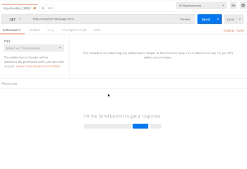

你可以觀察到， request 和 response 都有設定 `content-type: application/json` 告之對方資料的格式，以便解讀。
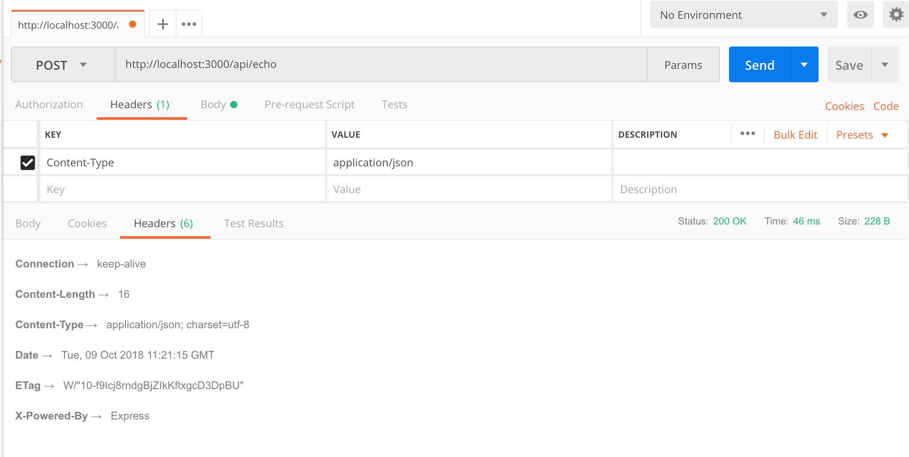

## 用 debug 模式驗証伺服器真有收到 JSON 資料
怎麼看後端真的有解讀/了解 JSON 資料呢？

1. 設定 VSCode debug 執行 `./bin/www`，修改 `launch.json`
    ``` json
    "configurations": [
        {
          "type": "node",
          "request": "launch",
          "name": "Launch Program",
          "program": "${workspaceFolder}/bin/www"
        }
    ]
    ```
1. 下中斷點，再用 POSTMAN 再送出一次 `POST /api/echo`，後端就會執行 API 的動作，然後停在中斷點
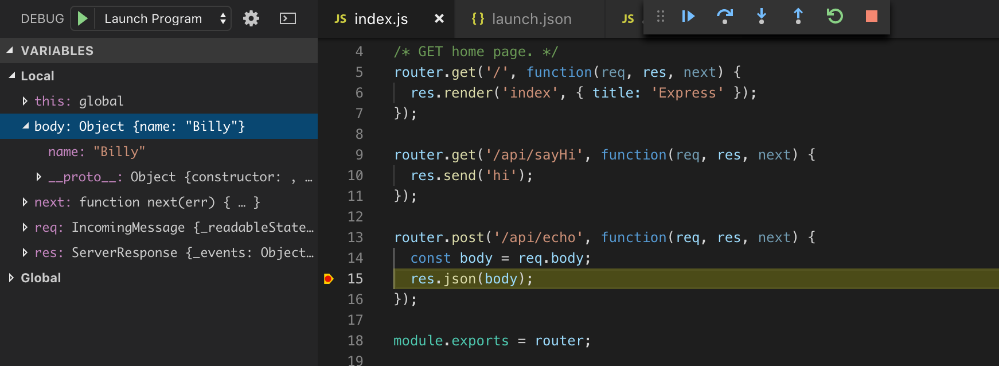
`body` 的型態真的是 `Object`!

> 其實，Express 可以解讀 JSON 文字轉成 javascript 的 Object，是因為有套用解讀 json `中間件(middleware)` [express.json()](http://expressjs.com/zh-tw/api.html#express.json) 的原因：

你可以註解掉看看，body 就得不到 JSON object 了。`中間件(middleware)` 會在二周目介紹它，目前只要了解 `app.use()` 會使所有 request 經過 middleware 處理。

# 總結
今天我們大概說明 request/response 訊息的格式並建立了 APIs，還用 Chrome 監看網路行為(ex:查看 GET request)，也用 POSTMAN 手動發出 request (ex: 送出 JSON 資料的 POST request)。
